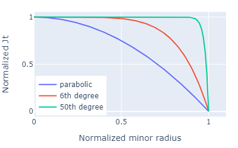

# Tokamak equilibrium code

## Overview

This repository provides general tokamak equilibrium calculation codes.

## New features

- (Apr. 11, 2023) Modified the code to apply to general tokamak.
- Constraint conditions such as pressure, flux, br, and bz can now be set in equilibrium calculations.

## Features of this equilibrium calculation code

- Supports output of calculation results to relational database.
- Supports output to g eqdsk format.
- [Tracing guiding center orbit](doc/tracing_guiding_center_orbit.md)

[g eqdsk format](https://w3.pppl.gov/ntcc/TORAY/G_EQDSK.pdf): Format of equilibrium information used by efit.

## Other documents

- [Procedure of equilibrium calculation](doc/equilibrium_en.md)
- [Definition of parameters](doc/def_of_params.md)
- [Input and output parameters](doc/1_params.md)
- [Introducig QUEST](doc/introducing_quest.md)
- [Magnetics Calculation](doc/magnetics_cal.md)
- [Tracing magnetic field lines](doc/tracing_mag_lines.md)
- [Tracing guiding center orbit](doc/tracing_guiding_center_orbit.md)
- [Equations of magnetics](doc/magnetics_en.md)
- [Derivation of the Grad-Shafranov equation](doc/grad_shafranov_eq.md)

## Getting started

1. Clone this project using VS code etc.
1. Go to the cloned directory, and execute below to install required modules.

   windows
  
   ```shell
   > python -m pip install -r requirements.txt
   ```

   Mac

   ```shell
   > python3 -m pip install -r requirements.txt
   ```

   - Be aware of whether or not you use a virtual environment.  
   - When using it, execute the above command under a virtual environment.

1. Excecute "1_make_fundamental_matrix.py" in root directory.  
   Please run it only once after cloning.  
   This create fundamental magnetic matrix of coils and plasmas.  
   The calculation may take an hour or more.  
   (Of course you can also copy and paste from elsewhere.)
1. Execute 'equalibrium.ipynb' in the root directory in order from the top as an example.

## Edit and execute your file

Editing files managed by Git can cause conflicts and make it impossible to pull.  
In this case, it is better to edit after changing the file name.  
In particular, file names or directory names starting with "0_" are out of Git's control.  
If you execute the equilibrium code in a subdirectory, the current directory must be the root directory.  
So put the following at the beginning of the file:  

```python
import os
os.chdir('..') 
# current working directory can be get by os.getcwd()
```

### Calculation condition

An example of the calculation conditions can be found in the condition of'equilibrium.ipynb'.  
The unit used in the parameter is the MKSA system of units. For example, the parameter of 'ip':-100.0e+3 means -100.0 [kA] of plasma current.  

- cur_ip : setting of initial plasma  
  - ip : float  
    plasma current
  - r0 : float  
    major radius of initial plasma  
  - z0 : float  
    vertical position of initial plasma
  - radius : float  
    minor radius of initial plasma
  - degree : float, default 2, optional  
    degree of initial plasma profile, ex. parabolic profile when degree = 2  
  
- cur_tf: setting of toroidal coil
  - tf : float  
    toroidal coil current
  - turn : int  
    number of toroidal coils
  - rewind: boolean, optional  
    presence or absence of rewind
- constraints_pressure: setting for plasma pressure constraints, optional
  - name: dict  
    name of constrain
    - position: (float, float)
    - pressure: float
    - weight: float  
      weighting factor relative to satisfy Grad-Shafranov eq.
- fix_pos : boolean [True or False], optional  
  Whether to fix the position of the magnetic axis to the plasma initial position
- num_dpr : int  
  polynomial degree of the pressure gradient
- num_di2 : int  
  polynomial degree of the gradient of square poloidal current

### Example of calculation condition

```python:
condition = {
    # TF current
    'cur_tf':{'tf': +50.0e+3, 'turn': 16, 
    #'rewind': True, # rewind of tf coil
    },
    
    # initial plasma profile
    'cur_ip':{'ip':+100.0e+3, 'r0':0.65, 'z0':0.0, 'radius':0.3, 'degree': 2.0},
    
    # PF currents
    'cur_pf':{'hcult16':0.0,'pf17t12':-1.0e+3, 'pf26t36':-1.0e+3,'pf4_1ab3_cc2':0.0,'pf35_2':0.0, },
    
    # number of coefficients
    'num_dpr':1, # dp/df
    'num_di2':1, # di2/df

    # 'constraints':{
    #     'name1':{'point':(0.3, 0.0), 'pressure':20.0, 'weight':1.0},
    #     'name2':{'point':(0.4, 0.0), 'pressure':30.0, 'weight':1.0},  
    #     'name3':{'point':(0.6, 0.0), 'pressure':40.0, 'weight':1.0},

    #     'flc08':{'point':(0.1985,  0.450), 'flux':0.003, 'weight':1.0},
    #     'f_im0':{'point':(0.1985,  0.0  ), 'flux':0.007, 'weight':1.0},
    #     'flc17':{'point':(0.1985, -0.450), 'flux':0.003, 'weight':1.0},

    #     'name4':{'point':(0.2, 0.4), 'br': 0.01, 'weight':0.0},
    #     'name5':{'point':(0.2, 0.0), 'br': 0.00, 'weight':0.0},  
    #     'name6':{'point':(0.2,-0.4), 'br':-0.01, 'weight':0.0},
    
    #     'name7':{'point':(0.0, 0.4), 'bz':0.036, 'weight':0.0},
    #     'name8':{'point':(0.0, 0.0), 'bz':0.060, 'weight':10.0},  
    #     'name9':{'point':(0.0,-0.4), 'bz':0.036, 'weight':0.0},      
    # },

    # flag to fix magnetic axis at initial plasma profile (r0, z0) 
    #'fix_pos': True,

    # calculate flux (r, z): result is set to 'fl_val'.
    'fl_pos':{'flc8':(0.1985, 0.450), 'f_im':(0.1985, 0.0), 'flc17':(0.1985, -0.450),
              'fls1':(1.374, 0.450), 'fls5':(1.374, 0.0), 'fls9':(1.374, -0.481)},
    # calculate Br(r, z): result is set to 'br_val'
    #'br_pos':{'r1000z0':(1.0, 1.0)},
    # calculate Bz(r, z): result is set to 'bz_val'
    #'bz_pos':{'r0z0':(0.0, 0.0)},
    }
```

Calculation conditions are described in python dictionary type.
Namely, 'parameter name':value, etc.  

The fl_pos, br_pos, and bz_pos are the positions to calculate flux, Br, and Bz, respectively after finishing the equilibrium calculation.

The specifiable PF coil name can be found in '/colis/data_npy/'.

### Constrains

Constraint conditions can be set for pressure, magnetic flux, Br, and Bz.  
Please refer to the calculation condition example for how to set the binding conditions.  
Adjust the weight factor to 1, 10, 100, etc. to adjust the degree of constraint enforcement.  
The result of applying the constraint is added to the input condition.  
In the example below, when the pressure is set to 40Pa, the calculated result is 40.179Pa.  

```python:
cond['constraints']
```

```python:
{'name3': {'point': (0.6, 0.0),
  'pressure': 40.0,
  'weight': 1.0,
  'pressure_calc': 40.178728138256936}}
```

## How to check the calculation result

### Equilibrium calculation

Equilibrium calculation is executed with the following command.  
All the calculation results are assigned to the variable cond as a python dictionary type.

```shell
cond = sb.calc_equilibrium(condition)
```

### Negative pressure

If the calculation did not converge due to negative plasma pressure, please try to increase the vertical fields, or try to move plasma initial position r0 to outward.


### Calculated parameters

You can see what was calculated with '.keys()', which is a method to obtains a key list.

```python:
cond.keys()
```

[Explanation of input and output parameters](doc/1_params.md)

You can check the calculation result with contour map or heat map.

```python:
import sub.plot as pl
pl.d_contour(cond['flux'])
```


```python:
import sub.plot as pl
pl.d_heatmap(cond['domain'])
```


## How to change resolution or calculation area

To change resolution or calculation area, please edit global_variables.py in root directory.  
Examples are shown in this file.  
In initial execution, the plasma matrix will be created, so please wait until the calculation is finished.  
The higher the resolution, the longer the calculation time.  

```python
    cname = "f0"
    cr_min, cr_max, cdel_r = 0.0, 1.4, 0.02
    cz_min, cz_max, cdel_z = -1.1, 1.1, 0.02

    #cname = 'f1'
    #cr_min, cr_max, cdel_r = 0.0, 1.8, 0.02
    #cz_min, cz_max, cdel_z = -1.8, 1.8, 0.02

    #cname = "f2"
    #cr_min, cr_max, cdel_r = 0.0, 1.4, 0.01
    #cz_min, cz_max, cdel_z = -1.1, 1.1, 0.01
```

## How to get g-file

The g file is created by inputting the calculation result of the equilibrium to the function as follows.

```python
# export g-file
import sub.g_file as sgf
sgf.write_g_file('g_quest.txt', cond)
```

## How to regist to database

When you perform equilibrium calculations with many parameters, you may want to register the many calculation results in the database.  
A sample code to do this is "equi_reg_db.ipynb" in the root.  
Before running this file, copy '.env_example' in the same directory, rename it to '.env', and edit it to suit your environment.

## Licence

When publishing a paper using this equilibrium code, please post the link appropriately.  
<https://gitlab.com/hasemac/tokamak_equilibrium>

## Support

We are accepting questions at any time by e-mail (hasegawa(atm)triam.kyushu-u.ac.jp).
