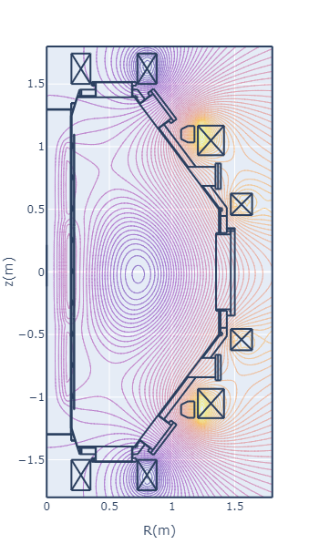
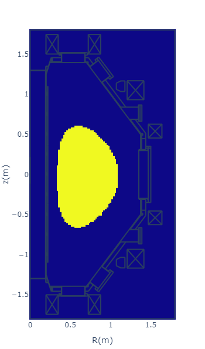

# Tokamak equilibrium code

## Overview

This repository provides a tokamak equilibrium calculation code, especially customized to QUEST tokamak.  

## Features of this equilibrium calculation code

- Supports output of calculation results to relational database.
- Supports output to g eqdsk format.

[g eqdsk format](https://w3.pppl.gov/ntcc/TORAY/G_EQDSK.pdf): Format of equilibrium information used by efit.

## Other documents

[Equations of magnetics](doc/magnetics_en.md)

[Procedure of equilibrium calculation](doc/equilibrium_en.md)

[Definition of parameters](doc/def_of_params.md)

[Introducig QUEST](doc/introducing_quest.md)

[Tracing magnetic field lines](doc/tracing_mag_lines.md)

## Getting started

"Plotly" is used to draw the graph. Therefore, **Node.js** must be installed in order to display the graph.

1. Clone this project using VS code etc.
2. Go to the cloned directory, and execute below to install required modules.

   ```shell
   > python -m pip install -r requirements.txt
   ```

   - Be aware of whether or not you use a virtual environment.
   - When using it, execute the above command under a virtual environment.
3. Execute 'equalibrium.ipynb' in the root directory in order from the top.

## How to set calculation conditions

An example of the calculation conditions can be found in the conditions of'equilibrium.ipynb'.  
The unit used in the parameter is the MKSA system of units. For example, the parameter of 'ip':-100.0e+3 means -100.0 [kA] of plasma current.  
If you want the position of the magnetic axis to be the initial position of the plasma, please set the fix_pos flag to be True in the calculation condition.

```python
    'fix_pos': True,
```

```python:
condition = {
    # TF current
    'cur_tf':{'tf': +50.0e+3, 'turn': 16},
    
    # initial plasma profile
    'cur_ip':{'ip':+100.0e+3, 'r0':0.65, 'z0':0.0, 'radius':0.3},
    
    # PF currents
    'cur_pf':{'hcult16':0.0,'pf17t12':-1.0e+3, 'pf26t36':-1.0e+3,'pf4_1ab3_cc2':0.0,'pf35_2':0.0, },
        
    # number of coefficients
    'num_dpr':1, # dp/df
    'num_di2':1, # di2/df

    # flag to fix magnetic axis at initial plasma profile (r0, z0) 
    #'fix_pos': True,
        
    # calculate flux (r, z): result is set to 'fl_val'.
    'fl_pos':{'flc8':(0.1985, 0.450), 'f_im':(0.1985, 0.0), 'flc17':(0.1985, -0.450),
              'fls1':(1.374, 0.450), 'fls5':(1.374, 0.0), 'fls9':(1.374, -0.481)},
    
    'resolution': gl.get_dmat_coarse(),
    }
```

Calculation conditions are described in python dictionary type.
Namely, 'parameter name':value, etc.

The specifiable PF coil name can be found in '/colis/data_npy/'.

## How to check the calculation result

### Equilibrium calculation

Equilibrium calculation is executed with the following command.  
All the calculation results are assigned to the variable cond as a python dictionary type.

```shell
cond = sb.calc_equilibrium(condition)
```

### Negative pressure

If the calculation did not converge due to negative plasma pressure, please try to increase the vertical fields, or try to move plasma initial position r0 to outward.


### Calculated parameters

You can see what was calculated with '.keys()', which is a method to obtains a key list.

```python:
cond.keys()
```

```python:
dict_keys(['cur_tf', 'cur_ip', 'cur_pf', 'num_dpr', 'num_di2', 'fl_pos', 'resolution', 'comments', 'error', 'vessel', 'flux_coil', 'jt', 'flux_jt', 'flux', 'ir_ax', 'iz_ax', 'r_ax', 'z_ax', 'conf_div', 'f_axis', 'f_surf', 'domain', 'jt_dp', 'jt_di2', 'param_dp', 'param_di2', 'iter', 'cal_result', 'pts', 'major_radius', 'minor_radius', 'elongation', 'triangularity', 'volume', 'cross_section', 'flux_normalized', 'fl_val', 'diff_pre', 'pressure', 'diff_pre_norm', 'pressure_norm', 'diff_i2', 'pol_current', 'diff_i2_norm', 'pol_current_norm', 'pressure_vol_average', 'beta_toroidal', 'toroidal_flux', 'toroidal_flux_diff', 'safety_factor', 'safety_factor_norm'])
```

|name|type|description|
|:---|:---|:---|
|jt | matirix | toroidal current density (jt_dp + jt_di2)|
|jt_dp | matrix | toroidal current density due to plasma pressure|
|jt_di2 | matrix | toroidal current density due to poloidal current|
|flux | matrix | total flux (flux_jt + flux_coil)|
|flux_normalized | matrix | normalized flux (0:axis -> 1:surface)|
|flux_jt | matrix | magnetic flux due to plasma current|
|flux_coil | matrix | magnetic flux due to PF coils|
|vessel | matrix | vacuum vessel (1:inside, 0:outside)|
|domain | matrix | plasma domain (1:inside, 0:outside)|
|ir_ax, iz_ax| int | mesh number of magnetic axis|
|r_ax, z_ax| float | position of magnetic axis|
|conf_div| int | configuration (1:divertor, 0: limiter)|
|f_axis, f_surf| float | flux of magnetic axis and last closed surface|
|param_dp| array | Coefficients of the pressure-derived fitting function<br>From lower-order terms: (a0,a1,a2,....)|
|diff_pre | matrix | matrix of dp/df|
|diff_pre_norm| array | array of dp/df from magnetic axis to surf. |
|pressure_norm| array | array of pressure from magnetic axis to surf.|
|param_di2| array | Coefficients of the poloidal_current-derived fitting function<br>From lower-order terms: (a0,a1,a2,....)|
|diff_i2| matrix | matrix of di^2/df|
|diff_i2_norm| array | array of di^2/df from magnetic axis to surf.|
|pol_current_norm| array | array of poloidal current from magnetic axis to surf.|
|iter| int | number of iterations |
|cal_result| int | 1: converged, 0: in calculation, -1: exit with error|
|pts| dictionary | Four points that define the top, bottom, left, and right of the plasma<br>ex. z_rmin: z position of the point where r is minimum.|
|major_radius | float | major radius|
|minor_radius | float | minor radius|
|elongation | float | elongation of plasma|
|triangularity | float | triangularity of plasma|
|volume| float | plasma volume, [$`m^{3}`$]|
|cross_section | float | plasma cross section [$`m^{2}`$]|
|fl_val| dictionary | flux at the position defined by fl_pos|
|pressure_vol_average| float | volume-averaged plasma pressure|
|beta_toroidal | float | toroidal beta|
|toroidal_flux | array | toroidal flux from magnetic axis to surf.|
|toroidal_flux_diff | array | derivative of toroidal flux, dphi/dx|
|safety_factor | matrix | safety factor|
|safety_factor_norm | array | array of sefety factor from magnetic axis to surf.|

You can check the calculation result with contour map or heat map.

"Plotly" is used to draw the graph. Therefore, **Node.js** must be installed in order to display the graph.

```python:
import sub.plot as pl
pl.d_contour(cond['flux'])
```



```python:
import sub.plot as pl
pl.d_heatmap(cond['domain'])
```



## How to get g-file

The g file is created by inputting the calculation result of the equilibrium to the function as follows.

```python
# export g-file
import sub.g_file as sgf
sgf.write_g_file('g_quest.txt', cond)
```

## How to regist to database

When you perform equilibrium calculations with many parameters, you may want to register the many calculation results in the database.  
A sample code to do this is "equi_reg_db.ipynb" in the root.  
Before running this file, copy '.env_example' in the same directory, rename it to '.env', and edit it to suit your environment.

## Licence

When publishing a paper using this equilibrium code, please post the link appropriately.  
<https://gitlab.com/hasemac/tokamak_equilibirum>

## Support

We are accepting questions at any time by e-mail (hasegawa(atm)triam.kyushu-u.ac.jp).
