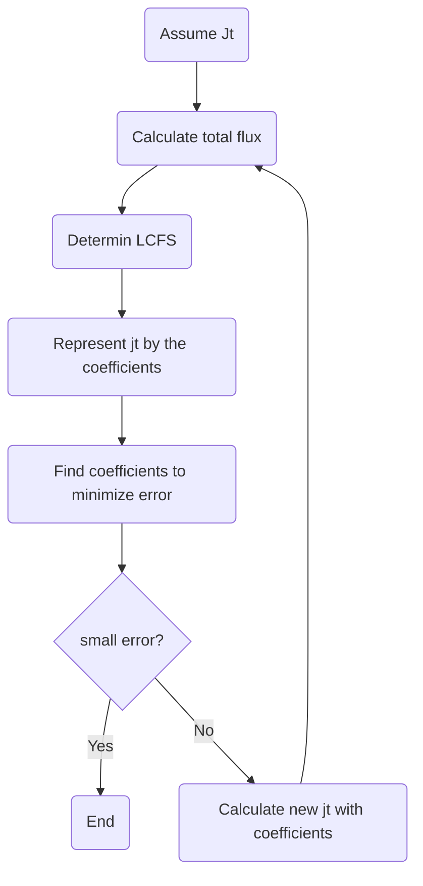

# Equilibrium calculation code

## Procedure of calculation

1. Assume $`j_{t}(R, z)`$.
1. Calculate the total magnetic flux $`\psi (R, z)`$ of the coil current and plasma current.
1. Determines the last closed flux surface (LCFS).
1. Represent $`j_{t}`$ at the corresponding point by a linear combination of the coefficients of $`dP/d \psi`$ and $`dI^ {2}/d \psi `$, which is $`j_{t1} (i, j)`$.
1. Find coefficients using the least squares method. The coefficients that minimizes the following values

```math
error = \frac{1}{2}\sum_{(i, j)}(j_{t1}(i, j)-j_{t0}(i, j))^{2}
```

, where $`j_{t0} (i, j)`$ is initial $`j_{t}`$ assumed firstly.



The plasma current density is given by the following equation.

```math
j_{\psi} = 2 \pi R \frac{dP(\psi)}{d\psi}+\frac{\mu_{0}}{4 \pi R} \frac{dI^{2}(\psi)}{d\psi}
```

$`P(\psi)`$：Plasma pressure

$`I(\psi)`$：Poloidal current, **including toroidal coil current**.

## Functions in the magnetic surface

Let $`x`$ be the variable of the polynomial, and $`x = (\psi- \psi_{M}) / (\psi_{B}- \psi_{M})`$.

$`x =0,\quad when\quad\psi = \psi_{M}`$: magnetic axis

$`x =1,\quad when\quad\psi = \psi_{B} `$: boundary

$` 0 \leqq x \leqq 1`$

The $`dP/d\psi`$ and $`dI^{2}/d\psi`$ are approximated by functions of $`x`$ as shown in the equations below.

```math
\frac{dP}{d \psi}(x)=\sum_{n=0}^{n_p}a_{n}x^{n}- x^{n_{p}+1} \sum_{n=0}^{n_{p}}a_{n}
```

```math
\frac{dI^{2}}{d \psi}(x)=\sum_{n=0}^{n_I}b_{n}x^{n}- x^{n_{I}+1} \sum_{n=0}^{n_{I}}b_{n}
```

Specifically, write down when $`n=2`$.

$`a_{0}+a_{1} x+a_{2}x^{2} -x^{3}(a_{0}+a_{1}+a{2})`$

$`=(1-x^{3})a_{0}+(x-x^{3})a_{1}+(x^{2}-x^{3})a_{2}`$

Thus, the coefficient for $`a_{n}`$ is given by $`x^{n}-x^{p}`$.  
The values ​​of these functions at the magnetic axis and the boundary are as follows.

```math
\frac{dP}{d \psi}(x)= 
\left \{ \begin{array}{ll}
a_{0}&x=0 \;(axis)\\
0&x=1 \; (boudary)
\end{array} \right.
```

```math
\frac{dI^{2}}{d \psi}(x)= 
\left \{ \begin{array}{ll}
b_{0}&x=0 \;(axis)\\
0&x=1 \; (boudary)
\end{array} \right.
```

This is a differentiated formula and actually needs to be integrated to calculate pressure and the like.

Integrating each term and setting it to zero at x = 1, each term becomes the following equation.

```math
\frac{x^{n+1}-1}{n+1} - \frac{x^{p+1}-1}{p+1}
```

Note that a coefficient is applied when integrating by $`\psi`$.

```math
P(\psi)=\int d \psi \frac{dP}{d \psi}(x)=(\psi_{B}- \psi_{M}) \int dx \: (\sum_{n=0}^{n_p}\alpha_{n}x^{n}- x^{n_{p}+1} \sum_{n=0}^{n_{p}}\alpha_{n})
```

```math
\because d \psi = (\psi_{B}- \psi_{M}) \: dx
```

```math
P(\psi)=(\psi_{B}- \psi_{M}) \sum_{n=0}^{n_{p}} a_{n} (\frac{x^{n+1}-1}{n+1} - \frac{x^{np+1}-1}{n_{p}+1})
```

## Representation with matrix

$`\boldsymbol{j}_{1} [np] = F [np, nc] \ \boldsymbol{c}[nc]`$  
$`\boldsymbol{j}_1`$ : new current profile  
$`\boldsymbol{c}`$ : array of fitting coefficients := [$`a_{n}`$, $`b_{n}`$]  
$`np`$ : number of plasma points  
$`nc`$ : number of fitting coefficients : = len($` a_n `$)+len($` b_n `$)    


## Constraint of pressure
Calculate pressure with Eq. 
```math
P(\psi)=(\psi_{B}- \psi_{M}) \sum_{n=0}^{n_{p}} a_{n} (\frac{x^{n+1}-1}{n+1} - \frac{x^{np+1}-1}{n_{p}+1})
```
And, get the matrix,  

$`P[npr, nc]`$  
$`npr`$ : number of constraint points  
$`nc`$ : number of fitting coefficients

Then, stack to F, and get new F

```math
\begin{pmatrix}
\boldsymbol{j}_1\\
\boldsymbol{p}_1
\end{pmatrix}
=
\begin{pmatrix}
F\\
P
\end{pmatrix}
[np+npr, nc]
\boldsymbol{c}[nc]
```
## Constraint of flux

$`\boldsymbol{j}_{1} [np] = F [np, nc] \boldsymbol{c} [n_{c}]`$  
$`np`$ : number of plasma points

Calculate flux of the flux loop position with each plasma current points with unit current.    
Then, make diagonal matrix.

```math
H[n_{p}, n_{p}] = 
\begin{pmatrix}
h_{1} & \cdots & 0 & \cdots & 0\\
\vdots & \ddots & & & \vdots \\
0 & & h_{i} & & 0 \\
\vdots & & & \ddots & \vdots \\
0 & \cdots & 0 & \cdots & h_{np}
\end{pmatrix}
```
Calculate $`HF`$, the shape is $`(HF)[np, nc]`$.  
Then take sum in column to calculate the total flux, and its shape is [1, nc].  
With other constraints, the matrix can be get as below.  
$`Fl[nfl, nc]`$ : each flux of constrains  
$`nfl`$ : number of constrain points  

And, stack to F, and get new F.

```math
\begin{pmatrix}
\boldsymbol{j}_1\\
\boldsymbol{p}_1\\
\boldsymbol{fl}_1
\end{pmatrix}
=
\begin{pmatrix}
F\\
P\\
Fl
\end{pmatrix}
[np+npr+nfl, nc]
\boldsymbol{c}[nc]
```
## Constraint of Br and Bz

Same to the flux, then the equation can be get as below.

```math
\begin{pmatrix}
\boldsymbol{j}_1\\
\boldsymbol{p}_1\\
\boldsymbol{fl}_1\\
\boldsymbol{br}_1\\
\boldsymbol{bz}_1
\end{pmatrix}
=
\begin{pmatrix}
F\\
P\\
Fl\\
Br\\
Bz
\end{pmatrix}
[np+npr+nfl+nbr+nbz, nc]
\boldsymbol{c}[nc]
```

## The least squares method

$j_{0i}$ : Initial current profile  
$j_{1i}$ : New current profile with coefficiencies

```math
j_{1i} = \sum_{j}f_{ij}c_{j}
```

$a_{j}$ : coefficiencies of polynominal function $dp/d\psi$,  $dI^{2}/d\psi$
, which should be determined with the least square method.  
$f_{ij}$ :  values calculated from normalized flux.

```math
E = \frac{1}{2}\sum_{i}(j_{1i}-j_{0i})^{2}
```

```math
E = \frac{1}{2}\sum_{i}(\sum_{j}f_{ij}c_{j}-j_{0i})^{2}
```

Find $a_{j}$ to minimize $E$ with the least mean square method.

```math
\begin{align}
\frac{\partial E}{\partial c_{k}}
&=\sum_{i}(\sum_{j}f_{ij}c_{j}-j_{0i})f_{ik}\\
&=\sum_{i,j}f_{ik}f_{ij}c_{j}-\sum_{i}f_{ik}j_{0i}\\
&=0
\end{align}
```

If you rewrite it in the form of a matrix, the $\boldsymbol{a}$ satisfies the following equation.

```math
F^{T}F\boldsymbol{a}=F^{T}\boldsymbol{j}_{0}
```

## The least squares method with constraints

A weighting factor is set so that each constraint has an equal effect.  
The equation is rewrite as below.

```math
\boldsymbol{v}_1 = M[nt, nc] \boldsymbol{c}[nc]
```
Here, 
```math
\boldsymbol{v}_1 =[\boldsymbol{j}_{1}, \boldsymbol{p}_1, \boldsymbol{fl}_1, \boldsymbol{br}_1, \boldsymbol{bz}_1]
```

```math
M = \begin{pmatrix}
F\\
P\\
Fl\\
Br\\
Bz
\end{pmatrix}
```

$`nt`$ : total number of equation = np+npr+nfl+nbr+nbz  

When weighting factors are present, the evaluation equation becomes:

```math
E = \frac{1}{2}\sum_{i}w_{i}^{2}(v_{1i}-v_{0i})^{2}
```
```math
\begin{align}
\frac{\partial E}{\partial c_{k}}
&=\sum_{i,j}w_{i}^{2}m_{ik}m_{ij}c_{j}-\sum_{i}w_{i}^{2}m_{ik}v_{0i}\\
&=0
\end{align}
```
And, in the matrix form,
```math
M^{T}WM\boldsymbol{c}=(WM)^{T}\boldsymbol{v}_{0}
```

Here, the matrix W is a diagonal matrix of squared weighting factors.
```math
W = 
\begin{pmatrix}
w_{1}^{2} & \cdots & 0 & \cdots & 0\\
\vdots & \ddots & & & \vdots \\
0 & & w_{i}^{2} & & 0 \\
\vdots & & & \ddots & \vdots \\
0 & \cdots & 0 & \cdots & w_{nt}^{2}
\end{pmatrix}
```

Note, the shape of matrix:  
W[nt, nt]  
M[nt, nc]  
c[nc]  
nt: total number of equations  
nc: number of fitting coefficients.

## Evaluation of error

There are several ways to evaluate errors.

1. Calculate the average of the original current densities.
1. Find the maximum difference between the new current density and the original current density.
1. When the ratio is less than a given value, the convergence occurs and the equilibrium calculation stops.

Expressed in Python, it becomes the following formula.

```python
error = np.max(np.abs(j0-j))/np.average(np.abs(j))
```

j0: New current density profile  
j: Original current density profile

## Handling of poloidal current

Poloidal currents include those derived from plasma and those derived from toroidal coils.  
The poloidal current in the equilibrium code also includ those derived from toroidal coils.  
Here, we represent the integral of $`dI^{2}/d\psi`$ as $`K(x)`$, and  K is adjusted so that $`K(x)=0`$ at $`x=1`$ (boundary). Thus,  

```math
I^{2}(x)=K(x)+I_{0}^{2}
```

$`I_{0}`$ : Derived from toroidal coil current  

$`I^{2}(x)`$ should be positive in the interval where x is from 0 (axis) to 1 (boundary).

```math
I(x) = 
\left \{ \begin{array}{ll}
+\sqrt{K(x)+I_{0}^{2}} &(I_{0}>0)\\
-\sqrt{K(x)+I_{0}^{2}} &(I_{0}<0)
\end{array} \right.
```

## Reference

- L.L. Lao, H.S. John, R.D. Stambaugh, A.G. Kellman, W. Pfeiffer, Reconstruction of current profile parameters and plasma shapes in tokamaks, Nucl. Fusion. 25 (1985) 1611. <https://doi.org/10.1088/0029-5515/25/11/007>.

- <https://www.jstage.jst.go.jp/article/ieejfms/124/5/124_5_393/_pdf>

- <https://www.jstage.jst.go.jp/article/jspf/79/2/79_2_123/_pdf>

- <http://www.jspf.or.jp/Journal/PDF_JSPF/jspf2003_02/jspf2003_02-121.pdf>
