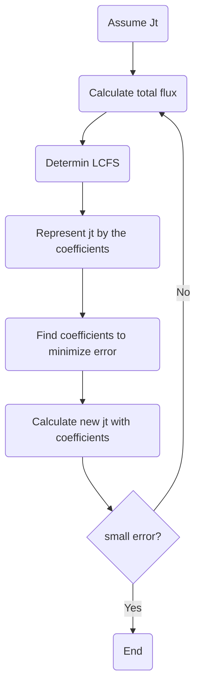

# Procedure of tokamak equilibrium calculation code

1. Assume $`j_{t}(R, z)`$.
1. Calculate the total magnetic flux $`\psi (R, z)`$ of the coil current and plasma current.
1. Determines the last closed flux surface (LCFS).
1. Represent $`j_{t}`$ at the corresponding point by a linear combination of the coefficients of $`dP/d \psi`$ and $`dI^ {2}/d \psi `$, which is $`j_{t1} (i, j)`$.
1. Find coefficients using the least squares method. The coefficients that minimizes the following values

```math
error = \frac{1}{2}\sum_{(i, j)}(j_{t1}(i, j)-j_{t0}(i, j))^{2}
```
, where $`j_{t0} (i, j)`$ is initial $`j_{t}`$ assumed firstly.



The plasma current density is given by the following equation.

```math
j_{\psi} = 2 \pi R \frac{dP(\psi)}{d\psi}+\frac{\mu_{0}}{4 \pi R} \frac{dI^{2}(\psi)}{d\psi}
```

$`P(\psi)`$：Plasma pressure

$`I(\psi)`$：Poloidal current, **including toroidal coil current**.
# Functions in the magnetic surface

Let $`x`$ be the variable of the polynomial, and $`x = (\psi- \psi_ {M}) / (\psi_{B}- \psi_{M})`$.

$`x =0,\quad when\quad\psi = \psi_{M}`$: magnetic axis

$`x =1,\quad when\quad\psi = \psi_{B} `$: boundary

$` 0 \leqq x \leqq 1`$

```math
\frac{dP(\psi)}{d \psi}=\sum_{n=0}^{n_p}\alpha_{n}x^{n}- x^{n_{p}+1} \sum_{n=0}^{n_{p}}\alpha_{n}
```

```math
\frac{dI^{2}(\psi)}{d \psi}=\sum_{n=0}^{n_I}\alpha_{n}x^{n}- x^{n_{I}+1} \sum_{n=0}^{n_{I}}\alpha_{n}
```

Specifically, write down when $`n=2`$.

$`a_{0}+a_{1} x+a_{2}x^{2} -x^{3}(a_{0}+a_{1}+a{2})`$

$`=(1-x^{3})a_{0}+(x-x^{3})a_{1}+(x^{2}-x^{3})a_{2}`$

Thus, the coefficient for $`a_{n}`$ is given by $`x^{n}-x^{p}`$.


This is a differentiated formula and actually needs to be integrated to calculate pressure and the like.

Integrating each term and setting it to zero at x = 1, each term becomes the following equation.

```math
\frac{x^{n+t}-1}{n+1} - \frac{x^{p+1}-1}{p+1}
```

# The least squares method

```math
E = \frac{1}{2}\sum_{i}(\sum_{j}a_{ij}x_{j}-b_{i})^{2}
```
Find $`x`$ that minimizes $`E`$.

```math
\begin{align}
\frac{\partial E}{\partial x_{k}}
&=\sum_{i}(\sum_{j}a_{ij}x_{j}-b_{i})a_{ik}\\
&=\sum_{i,j}a_{ik}a_{ij}x_{j}-\sum_{i}a_{ik}b_{i}\\
&=0
\end{align}
```
If you rewrite it in the form of a matrix, it becomes $`x`$ that satisfies the following equation.
```math
A^{T}Ax=A^{T}b
```

Here, $`b_{i}`$ assumes each point of $`j_{t0}`$. And, $`x_ {j}`$ assumes the coefficient of the polynomial represented by the magnetic surface function.
Therefore, $`a_{ij} x_{j}`$ is a linear combination of coefficients of $`j_{t1}`$ at the $`i`$ point.

# Definitions of beta
poloidal beta：

```math
\beta_{p}=\frac{<p>}{B_{\theta}^{2}(a) /2 \mu_{0}}
```


toroidal beta：

```math
\beta_{t}=\frac{<p>}{B_{t}^{2}/2 \mu_{0}}
```

normalized beta：

```math
\beta_{t}[\%] = \beta_{N} \frac{I_{p}}{a B_{t}} [MA/m.T]
```

$B_{t}$: Toroidal magnetic field at the center of the plasma

$<p> $: volume averaged pressure

$a$: minor radius

# Safty factor

```math
q = \frac{d\phi}{d\psi}
```
$`\phi`$: toroidal flux , $`\psi`$: poloidal flux

The toroidal flux can be given by the following equation.
```math
\phi=\int B_{\phi}dS=\int dS\frac{\mu_{0}I}{2 \pi R }
```
```math
2 \pi R B_{\phi}=\mu_{0}I
```
Thus, 

```math
\begin{align}
q = \frac{d\phi}{d\psi}
&=\frac{\mu_{0}}{2 \pi} \int dS \frac{1}{R} \frac{dI}{d\psi}\\
&=\frac{\mu_{0}}{4 \pi} \int dS \frac{1}{IR} \frac{dI^{2}}{d\psi}
\end{align}
```
Because, 
```math
\frac{dI}{d\psi}=\frac{1}{2 I}\frac{dI^{2}}{d\psi}
```

$`d\psi = (\psi_{B}- \psi_{M}) dx`$ from $`x = (\psi- \psi_ {M}) / (\psi_{B}- \psi_{M})`$.

Finally, 

```math
q =\frac{1}{\psi_{B}- \psi_{M}}\frac{\mu_{0}}{4 \pi} \int dS \frac{1}{IR} \frac{dI^{2}}{dx}
```

# Reference
Lao, L. L.; John, H. S.; Stambaugh, R.; Kellman, A. & Pfeiffer, W.; Reconstruction of current profile parameters and plasma shapes in tokamaks; Nuclear Fusion, 1985, 25, 1611

https://www.jstage.jst.go.jp/article/ieejfms/124/5/124_5_393/_pdf

https://www.jstage.jst.go.jp/article/jspf/79/2/79_2_123/_pdf