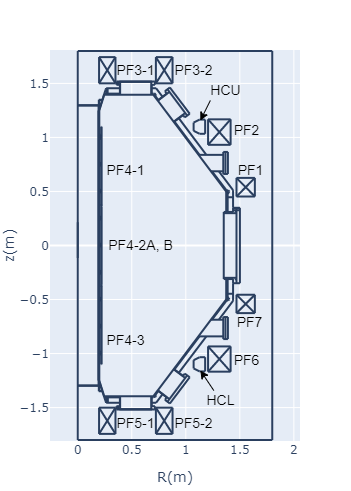

# Introducing QUEST

## coil location and specification

unit: (mm)
|name|turn|R|z|width|height|registance(mΩ)|inductance(mH)|
|:---|:---|:---|:---|:---|:---|:---|:---|
|PF1|12| 1555.2|+540|164.4|165.6|1.02|0.886|
||8|1527.8|+540|||0.67|0.407|
||4|1500.4|+540|||0.32|0.106|
|PF2|72|1311.6|+1100|203.2|228.6|27.47|23.2|
||36|1260.8|+1100|||13.21|6.05|
||18|1235.4|+1100|||6.47|1.56|
|PF3-1|41|273.0|+1615|117.4|194.7|3.34|0.88|
|PF3-2|41|800.0|+1615|117.4|191.5|9.7|4.3|
|PF4-1|72|157.4|+740|22.8|590.4|11.8|0.662|
|PF4-2A, B|72|163.2|0|34.4|791.9|6.3|0.542|
|PF4-2AB|144|163.2|0|34.4|791.9|12.6|2.17|
|HCU|16|1125.8|+1150|203.2|228.6|5.27|1.199|
||6|1100.4|+1150|||1.92|0.187|
|CC|1|1850|±492|||||
||2|1850|±508||||
||4|1850|±540||||
|TFC|16|||||||

|name|z|symmetrical coil|
|:---|:---|:---|
|PF4-3|-740|PF4-1|
|PF5-1|-1615|PF3-1|
|PF5-2|-1615|PF3-2|
|PF6|-1100|PF2|
|PF7|-540|PF1|

## coil names used in equilibrium calculations

- The PF coil is connected in series with the symmetrically positioned coil  
  examples:  
  pf17t12 -> (PF1, turn12) + (PF7, turn12)  
  pf26t36 -> (PF2, turn36) + (PF6, turn36)

- HCU and HCL are connected in opposite series to make horizontal magnetic fields.

