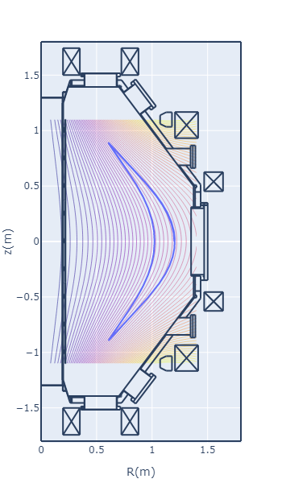

# Tracing guiding center orbit

## Setup

This calculation needs Br, Bz matrix due to plasma and PF coils.  
Execute "1_make_fundamental_matrix.py" in the root directory just once before running this calculation.  
It may take over 1 hour to buid the matrix.  

## How to calculate

Please execute "trace_guiding_center.ipynb" in root directory as an example.  
Calculation conditions are defined as below.

```python
# define particle condition
condition = {
    # mass of particle [kg]
    'mass': sc.m_e, # for electron
    #'mass': sc.m_p, # for hydrogen
    
    # amount of charge [coulomb]
    'charge': -sc.e, # for electron
    #'charge': sc.e,  # for hydrogen
    
    # total energy in [eV]
    'energy_ev':10.0e+3,
    # initial pitch angle, 0-180 degree
    'initial_pitch_angle':45,
    # initial position (x, y, z)
    'initial_pos':(1.0, 0.0, 0.0)
}
```

## Example of calculation result



for electron  
pf35_12: 3 kA  
total energy: 100 keV  
initial pitch angle: 45 degree  
initial position: (x, y, z) = (1.2, 0.0, 0.0)  

## Calculation procedure

1. get $\boldsymbol{B}$
2. calculate $E_{\perp}$ and $E_{//}$ from $\mu$ and $E$
3. (calculate $v_{\perp}$ and $v_{//}$ from $E_{\perp}$ and $E_{//}$)
4. (calculate $\alpha$ from $v_{//}$)
5. calculate $\boldsymbol{v}_{d}$
6. Solve the equation with Runge-Kutta.

## $\nabla B$ drift and curvature drift

- $\nabla B$ drift

  ```math
  \boldsymbol{v}_{\nabla B} = \frac{v_{\perp}^{2}}{2 \omega_{cj}} \frac{\boldsymbol{B} \times \nabla B}{B^{2}}
  ```

- Curvature drift
  
  ```math
  \boldsymbol{v}_{R} = \frac{v_{//}^{2}}{\omega_{cj}} \frac{\boldsymbol{B} \times \nabla B}{B^{2}}
  ```

Thus, total drift:

```math
\boldsymbol{v}_{d} = \frac{v_{//}^{2} + \frac{1}{2}v_{\perp}^{2}}{\omega_{cj}} \frac{\boldsymbol{B} \times \nabla B}{B^{2}}
```

See, Tokamaks SECOND EDITION, JOHN WESSON, eq 2.6.9  

```math
\omega_{cj} = \frac{q B}{m}
```

$m$ : [kG] mass of particle  
$q$ : [coulomb] particle charge  
$e$ : [coulomb] elementary charge, $1.602 \times 10^{-19}$ [coulomb]  
$B$ : [Tesla] magnetic field strength  

```math
\boldsymbol{v}_{d} =\frac{1}{q} (2 E_{//}+E_{\perp})\frac{\boldsymbol{B} \times \nabla B}{B^{3}}
```

For electron, $q=-e$.  

```math
\boldsymbol{v}_{d} = -\frac{1}{e}(2 E_{//}+E_{\perp})\frac{\boldsymbol{B} \times \nabla B}{B^{3}}
```

## Equations to solve

```math
\frac{d \boldsymbol{x}}{dt} = \boldsymbol{v}_{//} + \boldsymbol{v}_{d}
```

Although t is time, it is undesirable for the distance to fluctuate according to $\Delta t$.  
Therefore, let us solve the following equation, in which the moving distance is fixed.

```math
\frac{d \boldsymbol{x}}{ds} = \boldsymbol{v}_{0}
```

, where the $\boldsymbol{v}_{0}$ is a unit-vector of $\boldsymbol{v}_{//} + \boldsymbol{v}_{d}$.

conserved values:

- Total energy $E$  
  $E=E_{//}+E_{\perp}$
- magnetic moment $\mu$  
  $\mu=mv_{\perp}^{2}/2B = E_{\perp}/B$  

Other equations,

- pitch angle $\alpha$: $0^{\circ} \leqq \alpha \leqq 180^{\circ}$

- velocity $v$[m/s]  
  $v=\sqrt{2E/m_{e}}$  

- velocity parallel to B  
  $v_{//}=v \cos \alpha$  
  $\boldsymbol{v}_{//}=(v \cos \alpha) \boldsymbol{b}_{0}$  

- energy parallel to B  
  $E_{//} = \frac{1}{2}m_{e} v_{//}^{2}$

- energy perpendicular to B  
  $E_{\perp} = \frac{1}{2}m_{e} v_{\perp}^{2} = E-E_{//}$

- Cyclotron frequency  
  $f_{c} = \frac{q B}{2 \pi m_{e}}$
- Larmor radius  
  $r_{L}=v_{\perp}/2 \pi f_{c}$

### Drift in simple toroidal magnetic fields

Magnetic fields of toroidal field coil.

```math
\begin{align*}
&B_{r}=0 \\ 
&B_{\theta}=\frac{\mu_{0} I}{2 \pi r}\\
&B_{z}=0 
\end{align*}
```

Thus,

```math
\begin{align*}
\nabla B &= 
(\frac{\partial B}{\partial r}, \frac{1}{r}\frac{\partial B}{\partial \theta}, \frac{\partial B}{\partial z})\\
&=(-\frac{\mu_{0} I}{2 \pi r^{2}}, 0, 0)
\end{align*}
```

Thus, 

```math
\frac{\boldsymbol{B} \times \nabla B}{B^{3}}
= (0, 0, \frac{2 \pi r}{\mu_{0} I})
```
